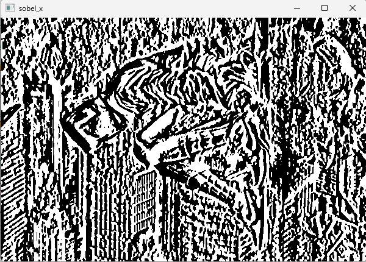
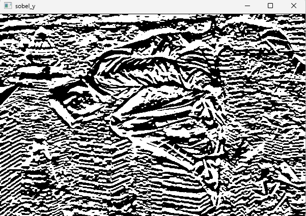
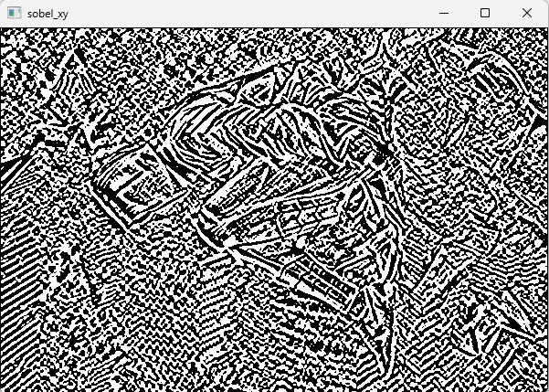
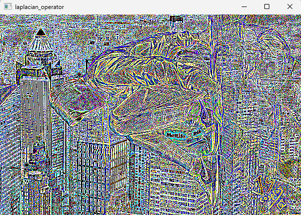
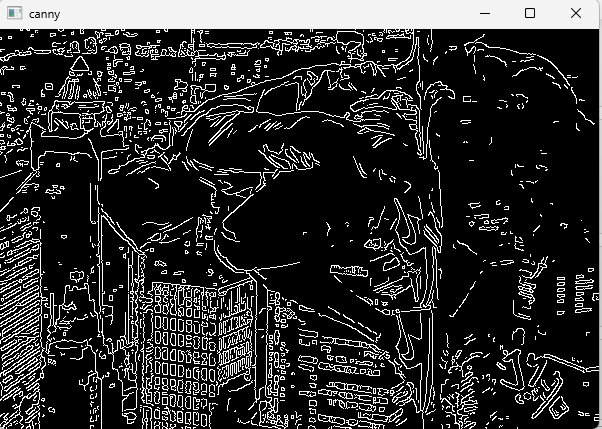

# Edge-Detection
## Aim:
To perform edge detection using Sobel, Laplacian, and Canny edge detectors.

## Software Required:
Anaconda - Python 3.7

## Algorithm:
### Step1:
Import the required
### Step2:
Convert the input image to gray , to get more details
and for laplcian operator, we have to convert input image to bgr format
### Step3:
Apply smoothing to reduce noise, here we are using gaussian blur 
### Step4:
Perform the edge detector operation
### Step5:
Show to detected image
## Program:
```
 NAME   : P.SANDEEP
 REG NO : 212221230074
```
```

# Import the packages

import cv2

# Load the image, Convert to grayscale and remove noise

i=cv2.imread('horse.jfif',-1)
gray=cv2.cvtColor(i,cv2.COLOR_BGR2GRAY)
img = cv2.GaussianBlur(gray,(3,3),0)


# SOBEL EDGE DETECTOR AND TO SHOW THE DETECTED IMAGE

sobel_x=cv2.Sobel(img,cv2.CV_64F,1,0,ksize=5)
cv2.imshow('sobel_x',sobel_x)
cv2.waitKey(0)
cv2.destroyAllWindows()

sobel_y=cv2.Sobel(img,cv2.CV_64F,0,1,ksize=5)
cv2.imshow('sobel_y',sobel_y)
cv2.waitKey(0)
cv2.destroyAllWindows()

sobel_xy=cv2.Sobel(img,cv2.CV_64F,1,1,ksize=5)
cv2.imshow('sobel_xy',sobel_xy)
cv2.waitKey(0)
cv2.destroyAllWindows()


# LAPLACIAN EDGE DETECTOR AND TO SHOW THE DETECTED IMAGE

rgb_image = cv2.cvtColor(i,cv2.COLOR_BGR2RGB)
laplacian_operator = cv2.Laplacian(rgb_image,cv2.CV_64F)
cv2.imshow('laplacian_operator',laplacian_operator)
cv2.waitKey(0)
cv2.destroyAllWindows()

# CANNY EDGE DETECTOR AND TO SHOW THE DETECTED IMAGE

canny_edges = cv2.Canny(img, 120, 150)
cv2.imshow('canny',canny_edges)
cv2.waitKey(0)
cv2.destroyAllWindows()

```
## Output:
### Original Image

### SOBEL EDGE DETECTOR
#### SOBEL X

#### SOBEL Y

#### SOBEL XY


### LAPLACIAN EDGE DETECTOR


### CANNY EDGE DETECTOR


## Result:
Thus the edges are detected using Sobel, Laplacian, and Canny edge detectors.
